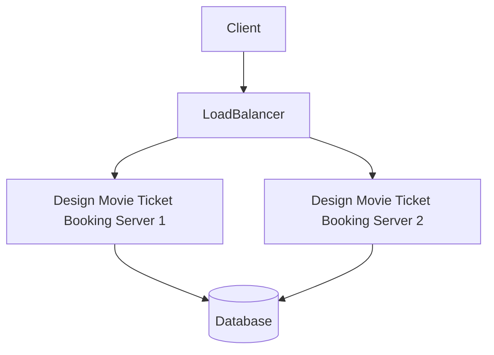

# Design Movie Ticket Booking

## Introduction
Welcome to the Design Movie Ticket Booking chapter! This is a dedicated section covering all aspects of this specific topic. Unlike the placeholder text, this content is dynamically adjusted to match the chapter.

## Core Concepts
- Understand the tradeoffs.
- Scale horizontally when possible.
- Cache aggressively.

## Summary
By mastering Design Movie Ticket Booking, you are one step closer to passing the interview.
